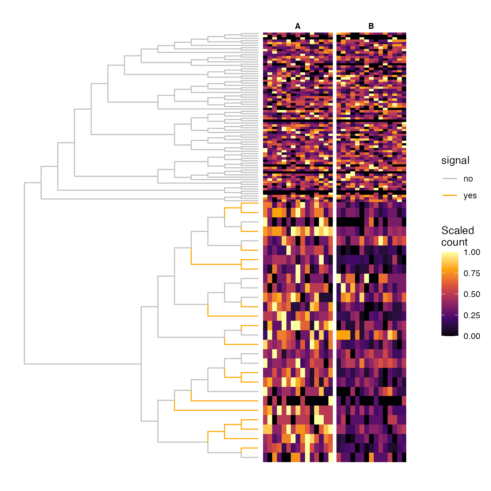
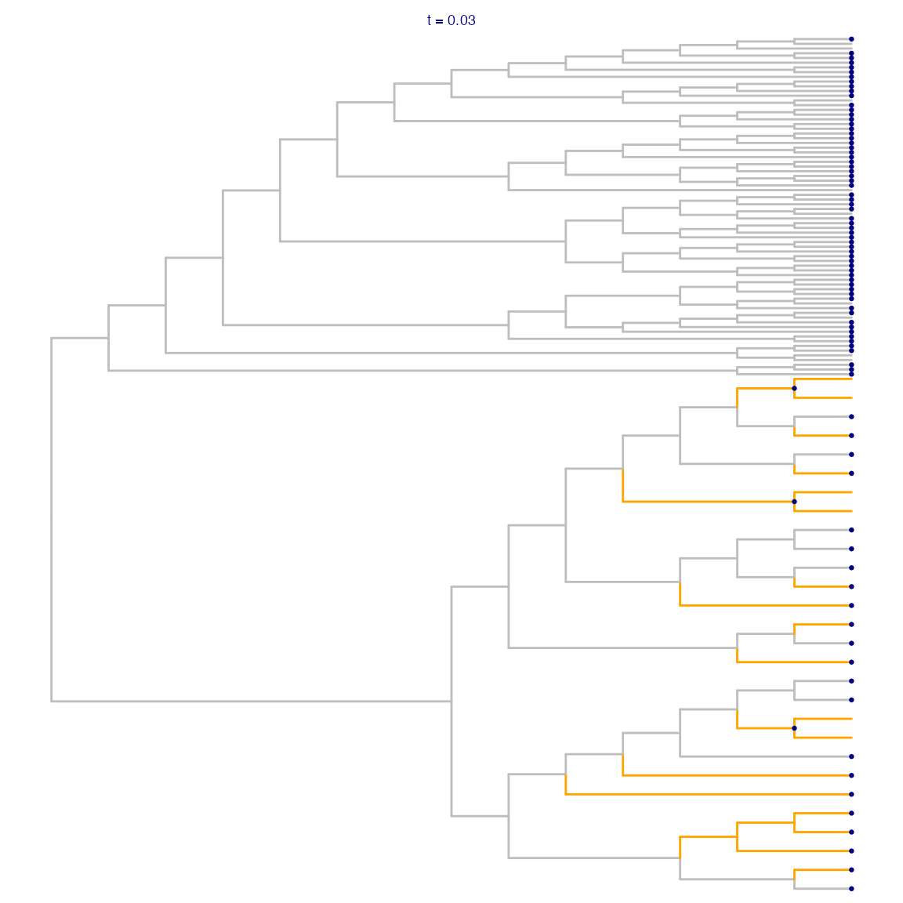
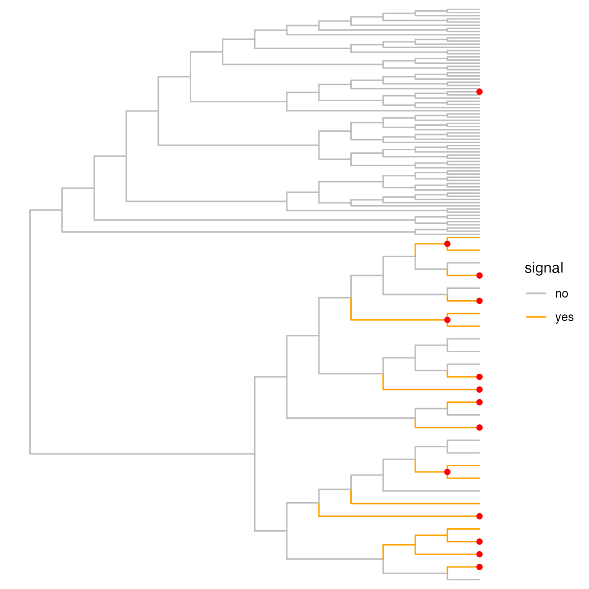
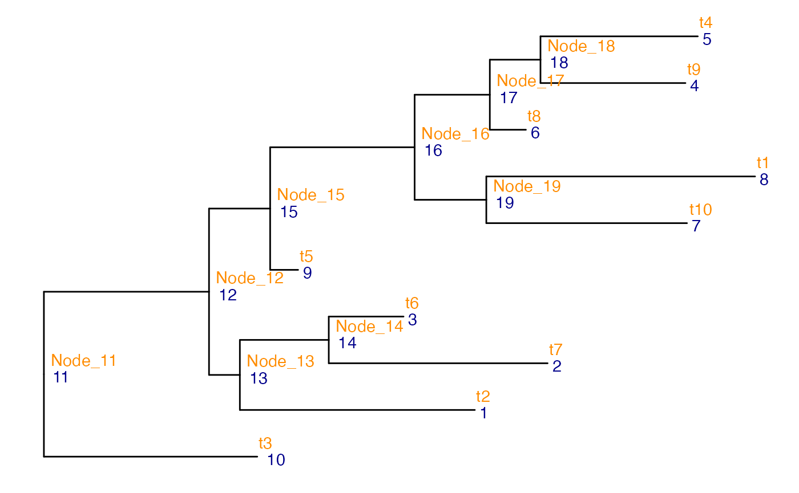

# Finding optimal resolution of hierarchical hypotheses with treeclimbR

## Introduction

`treeclimbR` is a method for analyzing hierarchical trees of entities,
such as phylogenies, at different levels of resolution. It proposes
multiple candidates (corresponding to different aggregation levels) that
capture the latent signal, and pinpoints branches or leaves that contain
features of interest, in a data-driven way. One motivation for such a
multi-level analysis is that the most highly resolved entities (e.g.,
individual species in a microbial context) may not be abundant enough to
allow a potential abundance difference between conditions to be reliably
detected. Aggregating abundances on a higher level in the tree can
detect families of species that are closely related and that all change
(possibly weakly but) concordantly. At the same time, blindly
aggregating to a higher level across the whole tree may imply losing the
ability to pinpoint specific species with a strong signal that may not
be shared with their closest neighbors in the tree. Taken together, this
motivates the development of a data-dependent aggregation approach,
which is also allowed to aggregate different parts of the tree at
different levels of resolution.

If you are using `treeclimbR`, please cite Huang et al. (2021), which
also contains the theoretical justifications and more details of the
method.

### Installation

`treeclimbR` can be installed from Bioconductor using the following
code:

``` r
if (!require("BiocManager", quietly = TRUE))
    install.packages("BiocManager")

BiocManager::install("treeclimbR")
```

It integrates seamlessly with the `TreeSummarizedExperiment` class,
which allows observed data, feature and sample annotations, as well as a
tree representing the hierarchical relationship among features (or
samples) to be stored in the same object.

### Preparation

This vignette outlines the main functionality of `treeclimbR`, using
simulated example data provided with the package. We start by loading
the packages that will be needed in the analyses below.

``` r
suppressPackageStartupMessages({
    library(TreeSummarizedExperiment)
    library(treeclimbR)
    library(ggtree)
    library(dplyr)
    library(ggplot2)
})
```

## Differential abundance (DA) analysis

The differential abundance (DA) workflow in `treeclimbR` is suitable in
situations where we have observed abundances (often counts) of a set of
entities in a set of samples, the entities can be represented as leaves
of a given tree, and we are interested in finding entities (or groups of
entities in the same subtree) whose abundance is associated with some
sample phenotype (e.g., different between two conditions). For example,
in Huang et al. (2021) we studied differences in the abundance of
microbial species between babies born vaginally or via C-section. We
also investigated differences in miRNA abundances between groups of mice
receiving transaortic constriction or sham surgery, and cell type
abundance differences between conditions at different clustering
granularities. In all these cases, the entities are naturally
represented as leaves in a tree (a phylogenetic tree in the first case,
a tree where internal nodes represent miRNA duplexes, primary
transcripts, and clusters of miRNAs for the second, and a clustering
tree defined based on the average similarity between baseline
high-resolution cell clusters for the third).

### Load and visualize example data

In this vignette, we will work with a simulated data set with 30 samples
(15 from each of two conditions) and 100 features. 18 of the features
are differentially abundant between the two conditions; this information
is stored in the `Signal` column of the object’s `rowData`. The features
represent leaves in a tree, and the data is stored in a
`TreeSummarizedExperiment` object. Below, we first load the data and
visualize the tree and the corresponding data.

``` r
## Read data
da_lse <- readRDS(system.file("extdata", "da_sim_100_30_18de.rds", 
                              package = "treeclimbR"))
da_lse
#> class: TreeSummarizedExperiment 
#> dim: 100 30 
#> metadata(1): parentNodeForSignal
#> assays(1): counts
#> rownames(100): t8 t85 ... t45 t92
#> rowData names(1): Signal
#> colnames(30): A_1 A_2 ... B_29 B_30
#> colData names(1): group
#> reducedDimNames(0):
#> mainExpName: NULL
#> altExpNames(0):
#> rowLinks: a LinkDataFrame (100 rows)
#> rowTree: 1 phylo tree(s) (100 leaves)
#> colLinks: NULL
#> colTree: NULL

## Generate tree visualization where true signal leaves are colored orange
## ...Find internal nodes in the subtrees where all leaves are differentially 
##    abundant. These will be colored orange.
nds <- joinNode(tree = rowTree(da_lse), 
                node = rownames(da_lse)[rowData(da_lse)$Signal])
br <- unlist(findDescendant(tree = rowTree(da_lse), node = nds,
                            only.leaf = FALSE, self.include = TRUE))
df_color <- data.frame(node = showNode(tree = rowTree(da_lse), 
                                       only.leaf = FALSE)) |>
    mutate(signal = ifelse(node %in% br, "yes", "no"))
## ...Generate tree
da_fig_tree <- ggtree(tr = rowTree(da_lse), layout = "rectangular", 
                      branch.length = "none", 
                      aes(color = signal)) %<+% df_color +
    scale_color_manual(values = c(no = "grey", yes = "orange"))
## ...Zoom into the subtree defined by a particular node. In this case, we 
##    know that all true signal leaves were sampled from the subtree defined 
##    by a particular node (stored in metadata(da_lse)$parentNodeForSignal).
da_fig_tree <- scaleClade(da_fig_tree, 
                          node = metadata(da_lse)$parentNodeForSignal, 
                          scale = 4)

## Extract count matrix and scale each row to [0, 1]
count <- assay(da_lse, "counts")
scale_count <- t(apply(count, 1, FUN = function(x) {
    xx <- x
    rx <- (max(xx) - min(xx))
    (xx - min(xx))/max(rx, 1)
}))
rownames(scale_count) <- rownames(count)
colnames(scale_count) <- colnames(count)

## Plot tree and heatmap of scaled counts
## ...Generate sample annotation
vv <- gsub(pattern = "_.*", "", colnames(count))
names(vv) <- colnames(scale_count)
anno_c <- structure(vv, names = vv)
TreeHeatmap(tree = rowTree(da_lse), tree_fig = da_fig_tree, 
            hm_data = scale_count, legend_title_hm = "Scaled\ncount",
            column_split = vv, rel_width = 0.6,
            tree_hm_gap = 0.3,
            column_split_label = anno_c) +
    scale_fill_viridis_c(option = "B") +
    scale_y_continuous(expand = c(0, 10))
#> Scale for fill is already present.
#> Adding another scale for fill, which will replace the existing scale.
#> Scale for y is already present.
#> Adding another scale for y, which will replace the existing scale.
```



### Aggregate counts for internal nodes

`treeclimbR` provides functionality to find an ‘optimal’ aggregation
level at which to interpret hierarchically structured data. Starting
from the `TreeSummarizedExperiment` above (containing the observed data
as well as the tree for the features), the first step is to calculate
aggregated values (in this case, counts) for all internal nodes. This is
needed so that we can then run a differential abundance analysis on
leaves and nodes simultaneously. The results from that analysis will
then be used to find the optimal aggregation level.

Here, we use the `aggTSE` function from the `TreeSummarizedExperiment`
package to calculate an aggregated count for each internal node in the
tree by summing the counts for all its descendant leaves. For other
applications, other aggregation methods (e.g., averaging) may be more
suitable. This can be controlled via the `rowFun` argument.

``` r
## Get a list of all node IDs
all_node <- showNode(tree = rowTree(da_lse), only.leaf = FALSE)

## Calculate counts for internal nodes
da_tse <- aggTSE(x = da_lse, rowLevel = all_node, rowFun = sum)
da_tse
#> class: TreeSummarizedExperiment 
#> dim: 199 30 
#> metadata(1): parentNodeForSignal
#> assays(1): counts
#> rownames(199): alias_1 alias_2 ... alias_198 alias_199
#> rowData names(1): Signal
#> colnames(30): A_1 A_2 ... B_29 B_30
#> colData names(1): group
#> reducedDimNames(0):
#> mainExpName: NULL
#> altExpNames(0):
#> rowLinks: a LinkDataFrame (199 rows)
#> rowTree: 1 phylo tree(s) (100 leaves)
#> colLinks: NULL
#> colTree: NULL
```

We see that the new `TreeSummarizedExperiment` now has 199 rows
(representing the original leaves + the internal nodes).

### Perform differential analysis for leaves and nodes

Next, we perform differential abundance analysis for each leaf and node,
comparing the average abundance in the two conditions. Here, any
suitable function can be used (depending on the properties of the data
matrix). `treeclimbR` provides a convenience function to perform the
differential abundance analysis using `edgeR`, which we will use here.
We will ask the wrapper function to filter out lowly abundant features
(with a total count below 15).

``` r
## Run differential analysis
da_res <- runDA(da_tse, assay = "counts", option = "glmQL", 
                design = model.matrix(~ group, data = colData(da_tse)), 
                contrast = c(0, 1), filter_min_count = 0, 
                filter_min_prop = 0, filter_min_total_count = 15)
```

The output of `runDA` contains the `edgeR` results, a list of the nodes
that were dropped due to a low total count, and the tree.

``` r
names(da_res)
#> [1] "edgeR_results" "nodes_drop"    "tree"
class(da_res$edgeR_results)
#> [1] "DGELRT"
#> attr(,"package")
#> [1] "edgeR"

## Nodes with too low total count
da_res$nodes_drop
#>  [1] "alias_32"  "alias_33"  "alias_40"  "alias_44"  "alias_51"  "alias_68" 
#>  [7] "alias_87"  "alias_97"  "alias_98"  "alias_134"
```

Again, note that any differential abundance method can be used, as long
as it produces a data frame with at least columns corresponding to the
node number, the p-value, and the inferred effect size (only the sign
will be used). For the `runDA` output, we can generate such a table with
the
[`nodeResult()`](https://csoneson.github.io/treeclimbR/reference/nodeResult.md)
function (where the `PValue` column contains the p-value, and the
`logFC` column provides information about the sign of the inferred
change):

``` r
da_tbl <- nodeResult(da_res, n = Inf, type = "DA")
dim(da_tbl)
#> [1] 189   6
head(da_tbl)
#>           node      logFC   logCPM         F       PValue          FDR
#> alias_102  102 -0.6288968 18.47205 220.86756 1.726711e-22 3.263484e-20
#> alias_114  114 -0.5747443 17.74475 120.77472 2.068389e-16 1.954628e-14
#> alias_103  103 -0.7103301 17.17136 108.14847 2.048994e-15 1.290866e-13
#> alias_115  115 -0.5947172 17.40516 104.05461 4.469264e-15 2.111727e-13
#> alias_116  116 -0.6789194 16.78855  75.36363 1.946830e-12 7.359019e-11
#> alias_110  110 -0.8245570 16.18132  65.27190 2.247915e-11 6.390613e-10
```

### Find candidates

Next, `treeclimbR` proposes a set of aggregation *candidates*,
corresponding to a range of values for a threshold parameter $t$ (see
(Huang et al. 2021)). A candidate consists of a set of nodes,
representing a specific pattern of aggregation. In general, higher
values of $t$ lead to aggregation further up in the tree (closer to the
root).

``` r
## Get candidates
da_cand <- getCand(tree = rowTree(da_tse), score_data = da_tbl, 
                   node_column = "node", p_column = "PValue",
                   threshold = 0.05, sign_column = "logFC", message = FALSE)
```

For a given $t$-value, we can indicate the corresponding candidate in
the tree. Note that at this point, we have not yet selected the optimal
aggregation level, nor are we making conclusions about which of the
retained nodes show a significant difference between the conditions. The
visualization thus simply illustrates which leaves would be aggregated
together if this candidate were to be chosen.

``` r
## All candidates
names(da_cand$candidate_list)
#>  [1] "0"    "0.01" "0.02" "0.03" "0.04" "0.05" "0.1"  "0.15" "0.2"  "0.25"
#> [11] "0.3"  "0.35" "0.4"  "0.45" "0.5"  "0.55" "0.6"  "0.65" "0.7"  "0.75"
#> [21] "0.8"  "0.85" "0.9"  "0.95" "1"

## Nodes contained in the candidate corresponding to t = 0.03
## This is a mix of leaves and internal nodes
(da_cand_0.03 <- da_cand$candidate_list[["0.03"]])
#>  [1]   1   2   5   6   7   8   9  10  11  12  15  16  17  18  21  22  23  24  25
#> [20]  26  27  28  29  30  31  34  35  36  37  38  39  41  42  43  45  46  47  48
#> [39]  49  50  52  53  54  55  56  57  58  59  60  61  62  63  64  65  66  67  69
#> [58]  70  71  72  73  74  75  76  77  78  79  80  81  82  83  84  85  86  88  89
#> [77]  90  91  92  93  94  95  96  99 100 108 122 117

## Visualize candidate
da_fig_tree +
    geom_point2(aes(subset = (node %in% da_cand_0.03)), 
                color = "navy", size = 0.5) +
    labs(title = "t = 0.03") +
    theme(legend.position = "none",
          plot.title = element_text(color = "navy", size = 7, 
                                    hjust = 0.5, vjust = -0.08))
```



### Select the optimal candidate

Finally, given the set of candidates extracted above, `treeclimbR` can
now extract the one providing the optimal aggregation level (Huang et
al. 2021).

``` r
## Evaluate candidates
da_best <- evalCand(tree = rowTree(da_tse), levels = da_cand$candidate_list, 
                    score_data = da_tbl, node_column = "node",
                    p_column = "PValue", sign_column = "logFC")
```

We can get a summary of all the candidates, as well as an indication of
which `treeclimbR` considers the optimal one, using the `infoCand`
function:

``` r
infoCand(object = da_best)
#>       t    upper_t is_valid method limit_rej level_name  best rej_leaf rej_node
#> 1  0.00 0.02142857     TRUE     BH      0.05          0 FALSE       17       17
#> 2  0.01 0.02142857     TRUE     BH      0.05       0.01  TRUE       17       14
#> 3  0.02 0.02142857     TRUE     BH      0.05       0.02  TRUE       17       14
#> 4  0.03 0.02142857    FALSE     BH      0.05       0.03 FALSE       17       14
#> 5  0.04 0.02142857    FALSE     BH      0.05       0.04 FALSE       17       14
#> 6  0.05 0.03846154    FALSE     BH      0.05       0.05 FALSE       18       13
#> 7  0.10 0.05000000    FALSE     BH      0.05        0.1 FALSE       21       14
#> 8  0.15 0.05000000    FALSE     BH      0.05       0.15 FALSE       21       14
#> 9  0.20 0.05000000    FALSE     BH      0.05        0.2 FALSE       21       14
#> 10 0.25 0.06923077    FALSE     BH      0.05       0.25 FALSE       22       13
#> 11 0.30 0.09166667    FALSE     BH      0.05        0.3 FALSE       23       12
#> 12 0.35 0.09166667    FALSE     BH      0.05       0.35 FALSE       23       12
#> 13 0.40 0.09166667    FALSE     BH      0.05        0.4 FALSE       23       12
#> 14 0.45 0.09166667    FALSE     BH      0.05       0.45 FALSE       23       12
#> 15 0.50 0.10000000    FALSE     BH      0.05        0.5 FALSE       26       13
#> 16 0.55 0.10000000    FALSE     BH      0.05       0.55 FALSE       26       13
#> 17 0.60 0.10000000    FALSE     BH      0.05        0.6 FALSE       26       13
#> 18 0.65 0.10000000    FALSE     BH      0.05       0.65 FALSE       26       13
#> 19 0.70 0.10000000    FALSE     BH      0.05        0.7 FALSE       26       13
#> 20 0.75 0.10000000    FALSE     BH      0.05       0.75 FALSE       26       13
#> 21 0.80 0.10000000    FALSE     BH      0.05        0.8 FALSE       26       13
#> 22 0.85 0.10000000    FALSE     BH      0.05       0.85 FALSE       26       13
#> 23 0.90 0.10000000    FALSE     BH      0.05        0.9 FALSE       26       13
#> 24 0.95 0.10000000    FALSE     BH      0.05       0.95 FALSE       26       13
#> 25 1.00 0.10000000    FALSE     BH      0.05          1 FALSE       22       11
```

We can also extract a vector of significant nodes from the optimal
candidate.

``` r
da_out <- topNodes(object = da_best, n = Inf, p_value = 0.05)
```

These nodes can then be indicated in the tree.

``` r
da_fig_tree +
    geom_point2(aes(subset = node %in% da_out$node),
                color = "red")
```



This visualization shows that in most cases, we correctly identify
groups of leaves changing synchronously, and we don’t combine true
signal nodes with non-changing ones.

In this case, since we are working with simulated data, we can estimate
the (leaf-level) false discovery rate and true positive rate for the
significant nodes. `treeclimbR` will automatically extract the
descendant leaves for each of the provided nodes, and perform the
evaluation on the leaf level.

``` r
fdr(rowTree(da_tse), truth = rownames(da_lse)[rowData(da_lse)$Signal], 
    found = da_out$node, only.leaf = TRUE)
#>        fdr 
#> 0.05882353

tpr(rowTree(da_tse), truth = rownames(da_lse)[rowData(da_lse)$Signal], 
    found = da_out$node, only.leaf = TRUE)
#>       tpr 
#> 0.8888889
```

## Differential state (DS) analysis

`treeclimbR` also provides functionality for performing so called
‘differential state analysis’ in a hierarchical setting. An example use
case for this type of analysis is in a multi-sample, multi-condition
single-cell RNA-seq data set with multiple cell types, where we are
interested in finding genes that are differentially expressed between
conditions in either a single (high-resolution) cell type
(subpopulation) or a group of similar cell subpopulations.

### Load and visualize example data

We load a simulated example data set with 20 genes and 500 cells. The
cells are assigned to 10 initial (high-resolution) clusters or
subpopulations (labelled ‘t1’ to ‘t10’), which are further
hierarchically clustered into larger meta-clusters. The hierarchical
clustering tree for the subpopulations is provided as the column tree of
the `TreeSummarizedExperiment` object. In addition, the cells come from
four different samples (two from condition ‘A’ and two from condition
‘B’). We are interested in finding genes that are differentially
expressed between the conditions (so called ‘state markers’) at some
level of the clustering tree.

``` r
ds_tse <- readRDS(system.file("extdata", "ds_sim_20_500_8de.rds", 
                              package = "treeclimbR"))
ds_tse
#> class: TreeSummarizedExperiment 
#> dim: 20 500 
#> metadata(0):
#> assays(1): counts
#> rownames: NULL
#> rowData names(1): Signal
#> colnames: NULL
#> colData names(3): cluster_id sample_id group
#> reducedDimNames(0):
#> mainExpName: NULL
#> altExpNames(0):
#> rowLinks: NULL
#> rowTree: NULL
#> colLinks: a LinkDataFrame (500 rows)
#> colTree: 1 phylo tree(s) (10 leaves)

## Assignment of cells to high-resolution clusters, samples and conditions
head(colData(ds_tse))
#> DataFrame with 6 rows and 3 columns
#>    cluster_id sample_id       group
#>   <character> <integer> <character>
#> 1          t7         4           B
#> 2          t7         4           B
#> 3          t1         4           B
#> 4          t4         1           A
#> 5          t6         1           A
#> 6          t1         1           A

## Tree providing the successive aggregation of the high-resolution clusters
## into more coarse-grained ones
## Node numbers are indicated in blue, node labels in orange
ggtree(colTree(ds_tse)) +
    geom_text2(aes(label = node), color = "darkblue",
               hjust = -0.5, vjust = 0.7) +
    geom_text2(aes(label = label), color = "darkorange",
               hjust = -0.1, vjust = -0.7)
```



The data set contains 8 genes that are simulated to be differentially
expressed between the two conditions. Four genes are differentially
expressed in all the clusters, two in clusters `t2`, `t6` and `t7`, and
two in clusters `t4` and `t5`.

``` r
rowData(ds_tse)[rowData(ds_tse)$Signal != "no", , drop = FALSE] 
#> DataFrame with 8 rows and 1 column
#>        Signal
#>   <character>
#> 1         all
#> 2  t2, t6, t7
#> 3         all
#> 4  t2, t6, t7
#> 5         all
#> 6         all
#> 7      t4, t5
#> 8      t4, t5
```

### Aggregate counts for internal nodes

As for the DA analysis, the first step is to aggregate the counts for
the internal nodes. In this use case, it effectively corresponds to
generating pseudobulk samples for each original sample and each internal
node in the tree.

``` r
ds_se <- aggDS(TSE = ds_tse, assay = "counts", sample_id = "sample_id", 
               group_id = "group", cluster_id = "cluster_id", FUN = sum)
#> Warning in TreeSummarizedExperiment::convertNode(tree = tree, node =
#> as.character(cell_info$cluster_id)): Multiple nodes are found to have the same
#> label.
ds_se
#> class: SummarizedExperiment 
#> dim: 20 4 
#> metadata(3): experiment_info agg_pars n_cells
#> assays(19): alias_1 alias_2 ... alias_18 alias_19
#> rownames: NULL
#> rowData names(0):
#> colnames(4): 4 1 2 3
#> colData names(1): group
```

Note how there is now one assay for each node in the tree (ten for the
leaves and nine for the internal nodes). Each of these assays contains
the aggregated counts for all genes in all cells belonging to the
corresponding node, split by sample ID.

This object also stores information about the number of cells
contributing to each node and sample

``` r
metadata(ds_se)$n_cells
#>            4   1   2   3
#> alias_1   10   8  14  12
#> alias_2   17  12  10  14
#> alias_3    9   9  18  11
#> alias_4   14  13  14   7
#> alias_5   11   9  13  14
#> alias_6   15  14  13  12
#> alias_7   16  18  16  13
#> alias_8   17  13  15   7
#> alias_9    7  12  13  13
#> alias_10  12  11  12  12
#> alias_11 128 119 138 115
#> alias_12 116 108 126 103
#> alias_13  36  29  42  37
#> alias_14  26  21  28  25
#> alias_15  80  79  84  66
#> alias_16  73  67  71  53
#> alias_17  40  36  40  33
#> alias_18  25  22  27  21
#> alias_19  33  31  31  20
```

### Perform differential analysis for leaves and nodes

Next, we perform the differential analysis. As for the DA analysis
above, `treeclimbR` provides a convenience function for applying `edgeR`
on the aggregated counts for each node. However, any suitable method can
be used.

``` r
ds_res <- runDS(SE = ds_se, tree = colTree(ds_tse), option = "glmQL", 
                design = model.matrix(~ group, data = colData(ds_se)), 
                contrast = c(0, 1), filter_min_count = 0, 
                filter_min_total_count = 1, filter_min_prop = 0, min_cells = 5, 
                group_column = "group", message = FALSE)
```

As before, the output contains the `edgeR` results for each node, the
tree, and the list of nodes that were dropped because of a too low
count.

``` r
names(ds_res)
#> [1] "edgeR_results" "tree"          "nodes_drop"
names(ds_res$edgeR_results)
#>  [1] "alias_1"  "alias_2"  "alias_3"  "alias_4"  "alias_5"  "alias_6" 
#>  [7] "alias_7"  "alias_8"  "alias_9"  "alias_10" "alias_11" "alias_12"
#> [13] "alias_13" "alias_14" "alias_15" "alias_16" "alias_17" "alias_18"
#> [19] "alias_19"
```

We can create a table with the node results as well. Note that this
table contains the results from all genes (features) at all nodes.

``` r
ds_tbl <- nodeResult(ds_res, type = "DS", n = Inf)
dim(ds_tbl)
#> [1] 380   7
head(ds_tbl)
#>           logFC   logCPM        F       PValue          FDR node feature
#> 3...1  1.647224 16.31850 2702.109 2.402920e-38 9.131097e-36   11       3
#> 1...2  1.623036 16.28457 2411.255 2.264792e-37 4.303105e-35   11       1
#> 6...3 -1.566550 16.27571 2177.354 1.684458e-36 2.133646e-34   11       6
#> 5...4 -1.528560 16.26806 2042.835 5.892588e-36 5.597959e-34   11       5
#> 6...5 -1.633382 16.19005 1671.077 3.012255e-34 2.289314e-32   13       6
#> 5...6 -1.577632 16.18364 1610.875 6.168542e-34 3.906743e-32   13       5
```

### Find candidates

The next step in the analysis is to generate a list of candidates. This
is done separately for each gene - hence, we first split the result
table above by the `feature` column, and then run
[`getCand()`](https://csoneson.github.io/treeclimbR/reference/getCand.md)
for each subtable.

``` r
## Split result table by feature
ds_tbl_list <- split(ds_tbl, f = ds_tbl$feature)

## Find candidates for each gene separately
ds_cand_list <- lapply(seq_along(ds_tbl_list), 
                       FUN = function(x) {
                           getCand(
                               tree = colTree(ds_tse),
                               t = seq(from = 0.05, to = 1, by = 0.05),
                               score_data = ds_tbl_list[[x]], 
                               node_column = "node", 
                               p_column = "PValue", 
                               sign_column = "logFC",
                               message = FALSE)$candidate_list
                       })
names(ds_cand_list) <- names(ds_tbl_list)
```

### Select the optimal candidate

We can then find the optimal candidate using the
[`evalCand()`](https://csoneson.github.io/treeclimbR/reference/evalCand.md)
function, and list the top hits.

``` r
ds_best <- evalCand(tree = colTree(ds_tse), type = "multiple", 
                    levels = ds_cand_list, score_data = ds_tbl_list, 
                    node_column = "node", 
                    p_column = "PValue", 
                    sign_column = "logFC", 
                    feature_column = "feature",
                    limit_rej = 0.05,
                    message = FALSE,
                    use_pseudo_leaf = FALSE)

ds_out <- topNodes(object = ds_best, n = Inf, p_value = 0.05) 
ds_out
#>            logFC   logCPM         F       PValue          FDR node feature
#> 1       1.623036 16.28457 2411.2547 2.264792e-37 4.303105e-35   11       1
#> 2       1.535873 16.20796 1350.8552 1.904533e-32 1.033890e-30   13       2
#> 3       1.647224 16.31850 2702.1091 2.402920e-38 9.131097e-36   11       3
#> 4      -1.613073 16.25077 1258.5324 7.530189e-32 3.576840e-30   13       4
#> 5      -1.528560 16.26806 2042.8352 5.892588e-36 5.597959e-34   11       5
#> 6      -1.566550 16.27571 2177.3536 1.684458e-36 2.133646e-34   11       6
#> 7...7   1.322240 16.11680  501.7687 3.012677e-24 4.770073e-23    5       7
#> 7...8   1.656876 16.10320  630.0092 1.171324e-09 5.634218e-09    9       7
#> 8...9  -1.523605 16.26492  719.5137 3.466238e-27 6.272241e-26    5       8
#> 8...10 -1.685560 16.34385  252.2818 6.672580e-08 2.848967e-07    9       8
#>               adj.p signal.node
#> 1      1.811834e-35        TRUE
#> 2      6.094507e-31        TRUE
#> 3      3.844672e-36        TRUE
#> 4      2.008050e-30        TRUE
#> 5      2.357035e-34        TRUE
#> 6      8.983774e-35        TRUE
#> 7...7  6.025355e-23        TRUE
#> 7...8  2.082354e-08        TRUE
#> 8...9  7.922830e-26        TRUE
#> 8...10 1.067613e-06        TRUE
```

As expected, we detect the eight truly differentially expressed features
(feature 1-8). Furthermore, we see that they have been aggregated to
different nodes in the tree. Features 1, 3, 5 and 6 are aggregated to
node 11, features 2 and 4 to node 13, and features 7 and 8 to nodes 5
and 9. Let’s see which leaves these internal nodes correspond to.

``` r
lapply(findDescendant(colTree(ds_tse), node = c(11, 13, 5, 9), 
                      self.include = TRUE, 
                      use.alias = FALSE, only.leaf = TRUE), 
       function(x) convertNode(colTree(ds_tse), node = x))
#> $Node_11
#>  [1] "t2"  "t7"  "t6"  "t9"  "t4"  "t8"  "t10" "t1"  "t5"  "t3" 
#> 
#> $Node_13
#> [1] "t2" "t7" "t6"
#> 
#> $t4
#> [1] "t4"
#> 
#> $t5
#> [1] "t5"
```

Indeed, comparing this to the ground truth provided above, we see that
each gene has been aggregated to the lowest node level that contains all
the original subpopulations where the gene was simulated to be
differentially expressed between conditions A and B:

``` r
rowData(ds_tse)[rowData(ds_tse)$Signal != "no", , drop = FALSE] 
#> DataFrame with 8 rows and 1 column
#>        Signal
#>   <character>
#> 1         all
#> 2  t2, t6, t7
#> 3         all
#> 4  t2, t6, t7
#> 5         all
#> 6         all
#> 7      t4, t5
#> 8      t4, t5
```

## Additional examples

Additional examples of applying `treeclimbR` to experimental data sets
can be found on
[GitHub](https://github.com/fionarhuang/treeclimbR_article).

## Session info

**This document was executed with the following package versions (click
to expand)**

``` r
sessionInfo()
#> R version 4.5.1 (2025-06-13)
#> Platform: aarch64-apple-darwin20
#> Running under: macOS Sequoia 15.7.1
#> 
#> Matrix products: default
#> BLAS:   /Library/Frameworks/R.framework/Versions/4.5-arm64/Resources/lib/libRblas.0.dylib 
#> LAPACK: /Library/Frameworks/R.framework/Versions/4.5-arm64/Resources/lib/libRlapack.dylib;  LAPACK version 3.12.1
#> 
#> locale:
#> [1] en_US.UTF-8/en_US.UTF-8/en_US.UTF-8/C/en_US.UTF-8/en_US.UTF-8
#> 
#> time zone: UTC
#> tzcode source: internal
#> 
#> attached base packages:
#> [1] stats4    stats     graphics  grDevices utils     datasets  methods  
#> [8] base     
#> 
#> other attached packages:
#>  [1] ggplot2_4.0.0                   dplyr_1.1.4                    
#>  [3] ggtree_3.99.2                   treeclimbR_1.7.0               
#>  [5] TreeSummarizedExperiment_2.17.1 Biostrings_2.77.2              
#>  [7] XVector_0.49.3                  SingleCellExperiment_1.31.1    
#>  [9] SummarizedExperiment_1.39.2     Biobase_2.69.1                 
#> [11] GenomicRanges_1.61.8            Seqinfo_0.99.4                 
#> [13] IRanges_2.43.8                  S4Vectors_0.47.6               
#> [15] BiocGenerics_0.55.4             generics_0.1.4                 
#> [17] MatrixGenerics_1.21.0           matrixStats_1.5.0              
#> [19] BiocStyle_2.37.1               
#> 
#> loaded via a namespace (and not attached):
#>   [1] RColorBrewer_1.1-3          jsonlite_2.0.0             
#>   [3] shape_1.4.6.1               magrittr_2.0.4             
#>   [5] TH.data_1.1-4               farver_2.1.2               
#>   [7] nloptr_2.2.1                rmarkdown_2.30             
#>   [9] GlobalOptions_0.1.2         fs_1.6.6                   
#>  [11] ragg_1.5.0                  vctrs_0.6.5                
#>  [13] minqa_1.2.8                 rstatix_0.7.3              
#>  [15] htmltools_0.5.8.1           S4Arrays_1.9.2             
#>  [17] broom_1.0.10                gridGraphics_0.5-1         
#>  [19] SparseArray_1.9.1           Formula_1.2-5              
#>  [21] sass_0.4.10                 bslib_0.9.0                
#>  [23] htmlwidgets_1.6.4           desc_1.4.3                 
#>  [25] plyr_1.8.9                  sandwich_3.1-1             
#>  [27] zoo_1.8-14                  cachem_1.1.0               
#>  [29] igraph_2.2.1                lifecycle_1.0.4            
#>  [31] iterators_1.0.14            pkgconfig_2.0.3            
#>  [33] Matrix_1.7-4                R6_2.6.1                   
#>  [35] fastmap_1.2.0               rbibutils_2.3              
#>  [37] clue_0.3-66                 aplot_0.2.9                
#>  [39] digest_0.6.37               colorspace_2.1-2           
#>  [41] ggnewscale_0.5.2            patchwork_1.3.2            
#>  [43] textshaping_1.0.4           ggpubr_0.6.2               
#>  [45] labeling_0.4.3              cytolib_2.21.0             
#>  [47] colorRamps_2.3.4            polyclip_1.10-7            
#>  [49] abind_1.4-8                 compiler_4.5.1             
#>  [51] fontquiver_0.2.1            withr_3.0.2                
#>  [53] doParallel_1.0.17           ConsensusClusterPlus_1.73.0
#>  [55] S7_0.2.0                    backports_1.5.0            
#>  [57] BiocParallel_1.43.4         viridis_0.6.5              
#>  [59] carData_3.0-5               ggforce_0.5.0              
#>  [61] ggsignif_0.6.4              MASS_7.3-65                
#>  [63] rappdirs_0.3.3              DelayedArray_0.35.4        
#>  [65] rjson_0.2.23                FlowSOM_2.17.0             
#>  [67] diffcyt_1.29.0              tools_4.5.1                
#>  [69] ape_5.8-1                   glue_1.8.0                 
#>  [71] nlme_3.1-168                grid_4.5.1                 
#>  [73] Rtsne_0.17                  cluster_2.1.8.1            
#>  [75] reshape2_1.4.4              gtable_0.3.6               
#>  [77] tidyr_1.3.1                 car_3.1-3                  
#>  [79] stringr_1.5.2               foreach_1.5.2              
#>  [81] pillar_1.11.1               yulab.utils_0.2.1          
#>  [83] limma_3.65.7                circlize_0.4.16            
#>  [85] splines_4.5.1               flowCore_2.21.0            
#>  [87] tweenr_2.0.3                treeio_1.33.0              
#>  [89] lattice_0.22-7              survival_3.8-3             
#>  [91] dirmult_0.1.3-5             RProtoBufLib_2.21.0        
#>  [93] tidyselect_1.2.1            fontLiberation_0.1.0       
#>  [95] ComplexHeatmap_2.25.2       locfit_1.5-9.12            
#>  [97] knitr_1.50                  gridExtra_2.3              
#>  [99] fontBitstreamVera_0.1.1     reformulas_0.4.2           
#> [101] bookdown_0.45               edgeR_4.7.6                
#> [103] xfun_0.53                   statmod_1.5.1              
#> [105] stringi_1.8.7               ggfun_0.2.0                
#> [107] lazyeval_0.2.2              yaml_2.3.10                
#> [109] boot_1.3-32                 evaluate_1.0.5             
#> [111] codetools_0.2-20            gdtools_0.4.4              
#> [113] tibble_3.3.0                BiocManager_1.30.26        
#> [115] ggplotify_0.1.3             cli_3.6.5                  
#> [117] systemfonts_1.3.1           Rdpack_2.6.4               
#> [119] jquerylib_0.1.4             Rcpp_1.1.0                 
#> [121] png_0.1-8                   XML_3.99-0.19              
#> [123] parallel_4.5.1              pkgdown_2.1.3.9000         
#> [125] lme4_1.1-37                 viridisLite_0.4.2          
#> [127] mvtnorm_1.3-3               tidytree_0.4.6             
#> [129] ggiraph_0.9.2               scales_1.4.0               
#> [131] purrr_1.1.0                 crayon_1.5.3               
#> [133] GetoptLong_1.0.5            rlang_1.1.6                
#> [135] multcomp_1.4-29
```

## References

Huang, Ruizhu, Charlotte Soneson, Pierre-Luc Germain, Thomas S B
Schmidt, Christian Von Mering, and Mark D Robinson. 2021. “treeclimbR
Pinpoints the Data-Dependent Resolution of Hierarchical Hypotheses.”
*Genome Biology* 22 (1): 157.
