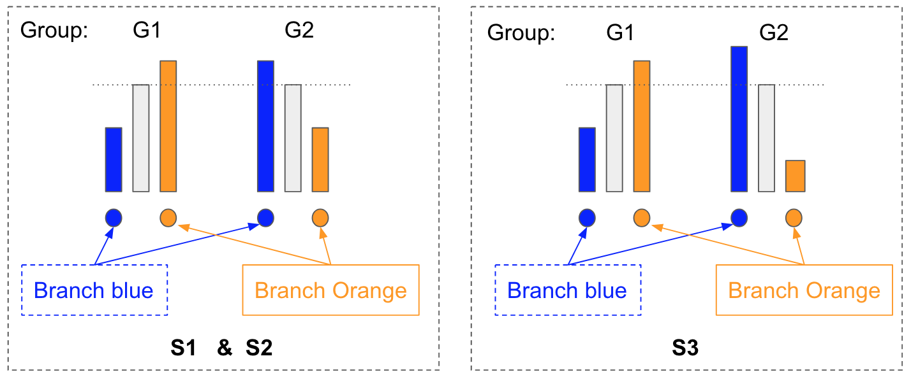

```{r setup, include=FALSE}
knitr::opts_chunk$set(echo = TRUE, message = FALSE, warning = FALSE)
```

# Introduction

We would like to simulate a count table, where some rows have differential
abundance between different phenotypic outcomes. The count table has entities in
rows and samples in columns. The easy way to do it is to randomly select some
rows and increase or decrease the counts of samples with certain phenotypic
outcomes. However, this might cause issues in compositional data because the
proportion of a row might change even though its abundance has not changed. To
avoid such issues, instead of adding counts to specific rows, we swap abundances
between groups of rows. The group is based on the hierarchical structure of the
entities, and groups with different sizes represent different hierarchical
level.

# Method

```{r scenarioDiff, echo= FALSE, fig.height = 3, fig.cap="\\label{fig1} Different simulated signal patters. The branches that have abundance phenotypic outcome associated are colored, and the others are shrinked to save space. The change direction is shown as color: blue (increase) and orange (decrease). The size of the points represents the amount of change (e.g., fold change) "}
suppressPackageStartupMessages({
  library(treeAGG2)
  library(ggtree)
  library(ggplot2)
  library(cowplot)
  library(ape)
})
set.seed(1)
exTree <- rtree(50)
leaf <- findOS(tree = exTree, node = c(52, 76), only.leaf = TRUE)
leaf1 <- leaf[[1]]
leaf2 <- leaf[[2]]
l1 <- length(leaf1)
l2 <- length(leaf2)
leaf3 <- c(23, 25)

shrink <- findExcl(tree = exTree, node = c(52, 76))
shrink <- shrink[!isLeaf(tree = exTree, node = shrink)]
fig1 <- viewBranch(tree = exTree, hlight_node = c(52, 76),
           hlight_alpha = 0.3, hlight_fill = c("blue", "orange"), 
           group_leaf = list(A = leaf1, B = leaf2), 
           group_color = c(A = "blue", B = "orange", "0" = "grey"),
           zoom_node = shrink, zoom_scale = 1/20) + 
         geom_point2(aes(subset = (node %in% leaf1)), 
                     color = "blue", size =  3) + 
         geom_point2(aes(subset = (node %in% leaf2)), 
                     color = "orange", size = 3) + 
         coord_flip() + scale_x_reverse()
fig2 <- viewBranch(tree = exTree, hlight_node = c(52, 76),
           hlight_alpha = 0.3, hlight_fill = c("blue", "orange"), 
           group_leaf = list(A = leaf1, B = leaf2), 
           group_color = c(A = "blue", B = "orange", "0" = "grey"),
           zoom_node = shrink, zoom_scale = 1/20) + 
         geom_point2(aes(subset = (node %in% leaf1)), 
                     color = "blue", size =  runif(l1)*3) + 
         geom_point2(aes(subset = (node %in% leaf2)), 
                     color = "orange", size = runif(l2)*3) + 
         coord_flip() + scale_x_reverse()
fig3 <- viewBranch(tree = exTree, hlight_node = c(52, 76),
           hlight_alpha = 0.3, hlight_fill = c("blue", "orange"), 
           group_leaf = list(A = leaf1, B = leaf3), 
           group_color = c(A = "blue", B = "orange", "0" = "grey"),
           zoom_node = shrink, zoom_scale = 1/20) + 
         geom_point2(aes(subset = (node %in% leaf1)), 
                     color = "blue", size =  3) + 
         geom_point2(aes(subset = (node %in% leaf3)), 
                     color = "orange", size = 3) + 
         coord_flip() + scale_x_reverse()


plot_grid(fig1, fig2, fig3, labels = c("S1", "S2", "S3"), nrow = 1)
```

The counts of entities in a sample are assumed to follow a Dirichlet Multinomial
distribution as has been suggested in several articles
[@Zhao2015,@Tang2016a,@Tang2016b,@Wu2016]:
$$\mathbf{x}=(x_1,\dots,x_K) \sim \text{dirmult}(n, \mathbf{\alpha})$$
\begin{equation}
\Pr(\mathbf{x}\mid\boldsymbol{\alpha})=
\frac{\left(n!\right)\Gamma\left(\alpha_0\right)}
{\Gamma\left(n+\alpha_0\right)}\prod_{k=1}^K
\frac{\Gamma(x_{k}+\alpha_{k})}{\left(x_{k}!\right)\Gamma(\alpha_{k})}
(\#eq:dirmult1)
\end{equation}

$\mathbf{x}=(x_1,\dots,x_K)$ are the counts of $K$ entities, $n$ is the
library size of a sample, $\mathbf{\alpha} = (\alpha_1, \alpha_2, ...,
\alpha_K)$ are the parameters for the distribution, and $\alpha_0 = \sum
\alpha_k$.

In the `r CRANpkg("dirmult")` package, the Dirichlet Multinomial distribution
(equation \@ref(eq:dirmult1)) is reparameterized with $\mathbf{\pi} = (\pi_1,
..., \pi_K)$ and $\theta$ so that $\alpha_0 = \frac{(1-\theta)}{\theta}$ and
$\alpha_k = \pi_k \alpha_0$. Here, $\pi_k$ is the expected proportion of entity
$k$ in a sample.

The technical details in the simulation procedure are as below.

1. **Estimate the parameters for simulation from a real data.** Estimate the
proportions $\mathbf{\hat{\pi}} = (\hat{\pi}_{1}, \hat{\pi}_{2}, ...,
\hat{\pi}_{m})$ and the overdispersion $\hat{\theta}$ from the real data
\cite{Charlson2010} via maximum likelihood using package `r CRANpkg("dirmult")`.

2. **Randomly select two branches with different proportions to swap.** The
selected branches are zoomed in (see Figure \@ref(fig:scenarioDiff)). We provide
3 simulation scenarios (S1, S2, and S3), which differ in how the swap is
performed.

+ S1 (the left plot in Figure \@ref(fig:scenarioDiff)): The proportions of
entities in sample $i$ are $\mathbf{p}^{G1}_{i}$ and $\mathbf{p}^{G2}_{i}$ for
the group G1 and G2 (the phenotypic outcome), respectively. The values of
$\mathbf{p}^{G1}_{i}$ and $\mathbf{p}^{G2}_{i}$ are randomly generated from the
Dirichlet distribution as below.
$$\mathbf{p}^{G1}_{i} \sim \text{Dirichlet}(\mathbf{\hat{\pi}}, \hat{\theta}).$$
$$\mathbf{p}^{G2}_{i} \sim \text{Dirichlet}(\mathbf{\hat{\pi}'}, \hat{\theta})$$
Compared with group G1, the proportions of entities on the blue and orange
branch have been changed correspondingly by a common factor $r$ or $\frac{1}{r}$
in group G2.
\begin{equation}
\left\{\begin{matrix}
 {\hat{\pi}}'_{k} =\hat{\pi}_{k}; &  k \notin \text{colored branches}\\
 {\hat{\pi}}'_{k} = r\hat{\pi}_{k}; &  k \in \text{ Blue branch } \\
 {\hat{\pi}}'_{k} =\frac{1}{r}\hat{\pi}_{k}; &  k \in \text{ Orange branch}
 \end{matrix}\right.
 (\#eq:s1)
\end{equation}
where $r = \frac{\sum_{k \in Orange} \hat{\pi}_{k}}{\sum_{k \in Blue}
\hat{\pi}_{k}}$ is the fold change.

+ S2 (the middle plot in Figure \@ref(fig:scenarioDiff)): The proportions of
entities in sample $i$ are $\mathbf{p}^{G1}_{i}$ and
$\mathbf{p}^{G2}_{i}$ for the group G1 and G1, respectively. They are randomly
generated from the Dirichlet distribution as below.
$$\mathbf{p}^{G1}_{i} \sim \text{Dirichlet}(\bf{\hat{\pi}}, \hat{\theta}).$$
$$\mathbf{p}^{G2}_{i} \sim \text{Dirichlet}(\hat{\pi}', \hat{\theta})$$
Compared with group G1, the proportions of entities on the colored branches have
changed by a common factor $r_k$ in group G2. $r_k$ varies among entities in the
same branch, but they are either all above one or all below one.
\begin{equation}
(\#eq:s2)
\left\{\begin{matrix}
 {\hat{\pi}}'_{k} =\hat{\pi}_{k}; &  k \notin \text{colored branches}\\
  {\hat{\pi}}'_{k} = r_k \hat{\pi}_{k}, 
  \quad r_k = 1 + \frac{\sum_{t \in Orange} \hat{\pi}_{t} -
  \sum_{t \in Blue} \hat{\pi}_{t}}{\sum_{k \in Blue} \hat{\pi}_{k} u_k} u_k;
  & k \in \text{ Blue branch } \\
  {\hat{\pi}}'_{k} = r_k \hat{\pi}_{k}, \quad r_k = 1 + \frac{\sum_{t \in Blue}
  \hat{\pi}_{t} - \sum_{t \in Orange} \hat{\pi}_{t}}{\sum_{k \in Orange} 
  \hat{\pi}_{k} u_k} u_k & k \in \text{ Orange branch}
 \end{matrix}\right.
\end{equation}
where $u_k$ is randomly generated from a uniformly distributed function as
formular \@ref(eq:uk) ($t$ is set to make sure $r_k$ is above zero).
\begin{equation}
(\#eq:uk)
\left\{\begin{matrix}
 u_k \sim \text{U}(t, 1), 
  \quad t = max(1-\frac{\sum_{t \in Orange} \hat{\pi}_{t}}{
  \sum_{t \in Blue} \hat{\pi}_{t}}, 0);
  & k \in \text{ Blue branch } \\
  u_k \sim \text{U}(t, 1), 
  \quad t = max(1-\frac{\sum_{t \in Blue} \hat{\pi}_{t}}{\sum_{t \in Orange
  } \hat{\pi}_{t}}, 0);
  & k \in \text{ Orange branch }
 \end{matrix}\right.
\end{equation}

The proof that the proportions of entities on the blue
branch is swapped with that on the orange branch is in the
[Appendix](#appendix).

+ S3 (the right plot in Figure \@ref(fig:scenarioDiff)): As shown in Figure
\@ref(fig:scenarioDiff), all entities in one of the selected branches are
colored as blue in S1, but only some entities from that branch are colored as
blue in S3. This means not all entities on that branch are differentially
abundant in S3. Technically, we could not say those entities with blue color in
Figure \@ref(fig:scenarioDiff) is a branch, but for the convenience in
explanation, they are refered as the blue branch. We allow users to adjust the
proportion of leaf nodes colored as blue in that zoom branch via an argument
`pct` in the `SimData` function.
$$\mathbf{p}^{G1}_{i} \sim \text{Dirichlet}(\mathbf{\hat{\pi}}, \hat{\theta}).$$
$$\mathbf{p}^{G2}_{i} \sim \text{Dirichlet}(\mathbf{\hat{\pi}}', \hat{\theta})$$
Compared with group G1, the proportions of entities on the orange branch have
changed by a common factor $c$ in group G2. The value $c$ could be chosen from 0
to 1. The entities on the blue branch have been changed by a common factor $r$
that depends on the value $c$.

\begin{equation}
\left\{\begin{matrix}
 {\hat{\pi}}'_{k} =\hat{\pi}_{k}; &  k \notin \text{colored branches}\\
 {\hat{\pi}}'_{k} = r \hat{\pi}_{k}; &  k \in \text{ Blue branch } \\
 {\hat{\pi}}'_{k} = c \hat{\pi}_{k}; &  k \in \text{ Orange branch}
 \end{matrix}\right.
 (\#eq:s3)
\end{equation}
where $r =  \frac{(1-c)\sum_{k \in Orange} \hat{\pi}_{k} + \sum_{k \in Blue}
\hat{\pi}_{k}}{\sum_{k \in Blue} \hat{\pi}_{k}}$ and $0 < c < 1$. 


To summarize, there are 3 simulation scenarios available in the function
`simData`. The differential abundance is achieved by swapping the proportions of
two selected branches in group G2. This would make the entities that are not
selected keep their abundance level across groups (phenotypic outcomes).

```{r scene, echo=FALSE, fig.cap= "The basic idea of three scenarios."}

```

In Figure \@ref(fig:scene), the height of the bar represent the proportion. We
see the tree structure as three parts, the two selected branches and the rest.
The phenotypic outcome is represented by the group (G1 or G2). The proportions
of the orange and blue branches are swapped between different groups in scenario
S1 and S2. The height of the orange bar in the group G2 is equal to the blue bar
in the group G1, and the height of the blue bar in group G2 is the same as that
of the orange bar in group G1. In S1, the increase or decrease in the proportion
is evenly distributed to the entities on the same branch by a common factor $r$
(on blue branch) or $\frac{1}{r}$ (on orange branch). However, in S2, the change
in the proportion is not evenly distributed and the factor $r_k$ varies on the
entities. In S3, the swap could be partial and depends on the value $c$. That's
why the height of the orange bar in group G2 could be different to that of the
blue bar in group G1.

The orange and blue branches are also referred as the signal branches in this
vignette.

# Example

`r Biocpkg("treeAGG2")` provides a function `simData` to simulate different
abundance patterns on the tree by swapping the relative abundance of two
branches. To simulate a count table, a hierarchical structure and a real count
table of entities are required. Here, we use a real throat microbiome data set
that includes a count table of 856 OTUs (operational taxonomic units) from 60
samples and a phylogenetic tree with 856 leaf nodes and 855 internal nodes
[@Charlson2010]. More details about the data could be seen via
`?GUniFrac::throat.tree` and `?GUniFrac::throat.otu.tab`.

We could load the real data as below.
```{r}
library(GUniFrac)
```

```{r}
# the hierarchical struture
data("throat.tree")
# the count table
data("throat.otu.tab")
```


## Signal branches known

If we already know for which two branches we want to swap the relative
abundance, we can feed `simData` the real data via the argument `tree` and
`data`, and the branches via `from.A` and `from.B` as below. How to manually
decide branches to swap could be found in section \@ref(selectBranch).
`throat.otu.tab` has the samples in the rows and entities in the columns, so we
need to transpose it before input to `simData`. To get reproducible result, the
random seed number is set.

```{r}
# simulate count table
set.seed(1122)
datA <- simData(tree = throat.tree,
                data = as.matrix(t(throat.otu.tab)),
                from.A = 1678,
                from.B = 1613)
datA
class(datA) 
```
The output *datA* is a `TreeSummarizedExperiment` object. More details about the
`TreeSummarizedExperiment` class could be found in the package `r
Biocpkg("TreeSummarizedExperiment")`.

The tree and count table could also be combined into a
`TreeSummarizedExperiment` object before using as the input for `simData`. 
```{r}
lse <- TreeSummarizedExperiment(rowTree = throat.tree, 
                                assays = list(t(throat.otu.tab)))
lse
set.seed(1122)
datB <- simData(obj = lse,
                from.A = 1678,
                from.B = 1613)
```

```{r}
# Two results are exactly the same
all.equal(datA, datB)
```
The results, `datA` and `datB`, are exactly the same. Each includes a simulated
count table in `assays` and the original input tree *throat.tree* as `rowTree`.
Additional information, such as fold changes of entities on the leaf level
(`FC`), the information of branches that have differential abundance (`branch`)
and the simulation scenario (`scenario`), is stored in `metadata`.

Estimating parameters from real data takes a while. In the vignette, we will do
simulation several times using the same real data. To save time, the function
`parEstimate` is used to do the estimation once and save results in the
`metadata` of the `TreeSummarizedExperiment` object for later use.

```{r}
names(metadata(lse))
# the parameters are saved in the metadata as assays.par
lse <- parEstimate(obj = lse)
names(metadata(lse))
```

The function `viewSim` can be used to view the differential abundance pattern on
the tree structure. The simulation result is assigned to the `obj`. The tree
could be shown in different shapes via `layout`. If the tree is large, we could
zoom in the branches with differential abundance via `zoom_scale`.
```{r}
viewSim(obj = datA, layout = "rectangular", zoom_scale = 20)
```

If more simulated tables are desired with the same simulation setting, the
argument `n` could be used.
```{r}
# simulate 2 count tables with the same setting
set.seed(1122)
datC <- simData(obj = lse,
                from.A = 1678,
                from.B = 1613, 
                n = 2)
length(assays(datC))
```


## Signal branches unknown

If we can't decide which branches to have the differential abundance pattern or
only decide one of them, we could let `simData` randomly select the suitable
branches. For example, we can select two branches where one of them has twice
the abundance of the other (`ratio = 2`).

```{r}
# set seed to have reproducible results
# branches are not given
set.seed(1122)
dat1 <- simData(obj = lse,
                ratio = 2)
```

The information about the selected branches is given in the `branch` slot of the
`metadata`. `A` and `B` are the labels of nodes that connect the selected
branches with the other part of the tree. The value in `ratio` is the ratio of
the abundance of branch `B` to that of branch `A`. It doesn't have to be exactly
the same as the value specified in the argument `ratio`. When there are not two
branches with exactly this ratio availabe in the tree, branches with value
closest to the value are given. The number of leaves in these two branches are
given in `A_tips` and `B_tips`. The relative abundance of the two branches are
in `A_prop` and `B_prop` with range from 0 to 1.
```{r}
metadata(dat1)$branch
```
Use `viewSim` to visualize the signal pattern on the tree structure.
```{r}
viewSim(obj = dat1, layout = "rectangular", zoom_scale = 1/50)
```

If we want to select branches from those with the number of leaves in a given
interval, it can be achieved by changing the values of `minTip.A`, `maxTip.A`,
`minTip.B` and `maxTip.B`. Here, one branch is limited to have at least 20
leaves and at most 40 leaves, the other is to have at least 20 and at most 100.

```{r}
set.seed(1122)
dat2 <- simData(obj = lse, 
                minTip.A = 20, maxTip.A = 40,
                minTip.B = 20, maxTip.B = 100,
                ratio = 2)
```

```{r}
viewSim(obj = dat2, layout = "rectangular", zoom_scale = 20)
```

Similarly, if branches with a certain abundance level are desired, it can be
done via `minPr.A` and `maxPr.A`. These two arguments restrict the count
proportion level of branch A. One could combine using these two arguments with
`ratio` to restrict the branch B.

```{r}
set.seed(1122)
dat3 <- simData(obj = lse,
                minTip.A = 20, maxTip.A = 40,
                minTip.B = 20, maxTip.B = 100, 
                maxPr.A = 0.01,
                ratio = 2)
rb <- rbind(metadata(dat2)$branch, metadata(dat3)$branch)
rownames(rb) <- c("dat2", "dat3")
rb
```
The proportion of branch A is `r rb[2, "A_prop"]` in `dat3`. This fulfills the
requirement that the relative abundance level of branch A isn't above $0.01$
(`maxPr.A`= 0.01).

```{r}
viewSim(obj = dat3, layout = "rectangular", zoom_scale = 20)
```

The ratio in `dat3` is `r metadata(dat3)$branch$ratio`, which is different from
the value given to the argument `ratio = 2`. It's because there is not any pair
of branches which has ratio exactly equal to 2. The pair having the value
closest to 2 will be returned.

If we want to fix one branch, `from.A` can be used. 
```{r}
# use the branch A selected in dat2.
set.seed(1122)
brA <- metadata(dat2)$branch$A
dat4 <- simData(from.A = brA,
                obj = lse, 
                minTip.A = 20, maxTip.A = 40,
                minTip.B = 20, maxTip.B = 100,
                ratio = 4)
# show the selected branches 
rb <- rbind(metadata(dat2)$branch, metadata(dat4)$branch)
rownames(rb) <- c("dat2", "dat4")
rb
```
Branch A in `dat2` and `dat4` are the same. 

## Different simulation scenarios

We can simulate different differential abundance patterns by changing the
`scenario`. The default scenario is "S1".
```{r}
# use the branches from dat4
# change scenario to S2
set.seed(1122)
dat5 <- simData(from.A = metadata(dat4)$branch$A,
                from.B = metadata(dat4)$branch$B,
                obj = lse, 
                scenario = "S2")
```

If `scenario = "S3"` is used, the argument `adjB` could also be used. It is the
$c$ value in formula \@ref(eq:s3) and could be chosen between 0 and 1. If it's
set as NULL, the swap is similar to S1 in that the proportions of the selected
branches are swapped. Note that the blue branch here is not the branch specified
by `from.A`. It should be only part of `from.A` as colored with blue in the S3
of Figure  \@ref(fig:scenarioDiff). Users could use `pct` equal to a value
between 0 and 1 to decide the percentage of leaves in `from.A` should be
selected as the blue branch.

```{r}
# use the branches from dat4
# change scenario to S3
set.seed(1122)
dat6 <- simData(from.A = metadata(dat4)$branch$A,
                from.B = metadata(dat4)$branch$B,
                obj = lse, pct = 0.6, adjB = NULL, 
                scenario = "S3")
```


If users are interested, the values of $c$ and $r$ in formula \@ref(eq:s3) are
stored as `FC` in the `metadata`. The names of *fc* are the node labels and the
numeric values are the fold changes of corresponding nodes. Each leaf node has a
fold change value. Those have values above one ($r$) are in the blue branch and
below one in the orange branch ($c$) (see S3 in Figure \@ref(fig:scenarioDiff))
```{r}
fc <- metadata(dat6)$FC
```


```{r}
p1 <- viewSim(obj = dat4, layout = "circular", zoom_scale = 20, 
              legend.theme = list(legend.position = c(0.6, 0.4),
                                  legend.background = element_rect(
                                fill="transparent")), 
              legend.title = "S1")
p2 <- viewSim(obj = dat5, layout = "circular", zoom_scale = 20, 
              legend.theme = list(legend.position = c(0.6, 0.4),
                                  legend.background = element_rect(
                                fill="transparent")),
              legend.title = "S2")
p3 <- viewSim(obj = dat6, layout = "circular", zoom_scale = 20, 
              legend.theme = list(legend.position = c(0.6, 0.4),
                                  legend.background = element_rect(
                                fill="transparent")),
              legend.title = "S3")
```

```{r}
library(cowplot)
plot_grid(p1, p3)
plot_grid(p2)
```

In scenario S3, points in a colored branch have the same color but different
sizes. This means the fold changes of entities in that branch are different in
values but same in the direction.

## Select branches {#selectBranch}

It's quite normal that a pair of branches that exactly fulfill the requirements
specified can't be found, especially when a small tree is provided. To
efficiently select suitable branches, we could summarize the information of
branches before the simulation using `selNode` and manually select one or two
branches.

The function `selNode` could be used to list all branches (`all = TRUE`) that
have the number of leaf nodes between 10 (`minTip = 10`) and 15 (`maxTip = 15`)
and the relative abundance between 0.03 (`minPr = 0.03`) and 0.05 (`maxPr =
0.05`) as below.

```{r}
(sel1 <- selNode(obj = lse, minTip = 11, maxTip = 12, 
                    minPr = 0.03, maxPr = 0.05,  all = TRUE))
```
The result has listed all branches that meet the requirements. The branch nodes
of these branches are given in the column `nodeNum` (the node number), `nodeLab`
(the node label), and `nodeLab_alias` (the alias of the node label). Here, the
column `nodeLab` has `NA` value because the tree has no label for the nodes
selected. The relative abundance of these branches, which is a value between 0
and 1, is given in the column `proportion`. The numbers of descendant leaves on
those branches are in column `numTip`.

We could take one of the branches, for example, the branch on the first row, as
the fixed branch. As a pair of branches is required in the simulation, the other
branch could be selected randomly by `simData` or manually as below. Let's say
the other branch should have roughly twice abundance as the currently selected
branch (`minPr = 0.06, maxPr = 0.07`). Of course, we don't want a branch that
has overlap with the currently selected one. For this reason, `skip` is used.

```{r}
(sel2 <- selNode(obj = lse, minPr = 0.06, maxPr = 0.07, 
                 skip = sel1$nodeLab_alias[1],
                 all = TRUE))
```

With the information above, we could take a branch that meets the requirement of
the abundance level and has propor size (number of desendant leaves).

If the sibling branch of a selected branch is need, the function `findSibling`
could be used. The node that connects the sibling branch and the other part of
the tree is found and the its node number is returned. The node number is named
with the node label. If the tree has no label for the output node and `use.alias
= FALSE` is specified, `NA` is used as the name; otherwise, an alias of the node
label is used (`use.alias = TRUE`). An alias of a node label is created by
prefixing "Node_" to the node number for internal nodes and "Leaf_" for leaf
nodes.
```{r}
findSibling(tree = rowTree(lse), 
            node = sel1$nodeLab_alias[3],
            use.alias = TRUE)
```

If users are curious about the descendant leaves of the selected branch, the
function `findOS` could be used. To see the descendants of a specific node, we 
could put the node number or label in `ancestor`.

```{r}
findOS(tree = rowTree(lse), node = sel2$nodeNum[6])
```

# Appendix {#appendix}

Proof: $$\sum_{g \in Blue} \hat{\pi}'_{g} = \sum_{g \in Orange} \hat{\pi}_{g}$$
$$\begin{aligned}
\sum_{g \in Blue} \hat{\pi}'_{g} 
&= \sum_{g \in Blue} r_g \hat{\pi}_{g} \\ 
&= \sum_{g \in Blue} \hat{\pi}_{g} r_g \\
&= \sum_{g \in Blue} \hat{\pi}_{g}(1 + \frac{\sum_{t \in Orange} \hat{\pi}_{t} 
- \sum_{t \in Blue} \hat{\pi}_{t}}{\sum_{t \in Blue} \hat{\pi}_{t} u_t} u_g) \\
&= \sum_{g \in Blue} \hat{\pi}_{g}(1 + \frac{\sum_{t \in Orange} \hat{\pi}_{t}
- \sum_{t \in Blue} \hat{\pi}_{t}}{\sum_{t \in Blue} \hat{\pi}_{t} u_t} u_g) \\
&= \sum_{g \in Blue} \hat{\pi}_{g} + \sum_{g \in Blue} \hat{\pi}_{g}
\frac{\sum_{t \in Orange} \hat{\pi}_{t} - \sum_{t \in Blue} 
\hat{\pi}_{t}}{\sum_{t \in Blue} \hat{\pi}_{t} u_t} u_g \\
&= \sum_{g \in Blue} \hat{\pi}_{g} + (\sum_{t \in Orange} \hat{\pi}_{t} -
\sum_{t \in Blue} \hat{\pi}_{t}) 
\frac{\sum_{g \in Blue} \hat{\pi}_{g} u_g}{\sum_{t \in Blue} 
\hat{\pi}_{t} u_t} \\
& = \sum_{t \in Orange} \hat{\pi}_{t} \\
& = \sum_{g \in Orange} \hat{\pi}_{g}
\end{aligned}$$

Proof: $$\sum_{g \in Orange} \hat{\pi}'_{g} = \sum_{g \in Blue} \hat{\pi}_{g}$$
Similar to the proof above.

# Reference